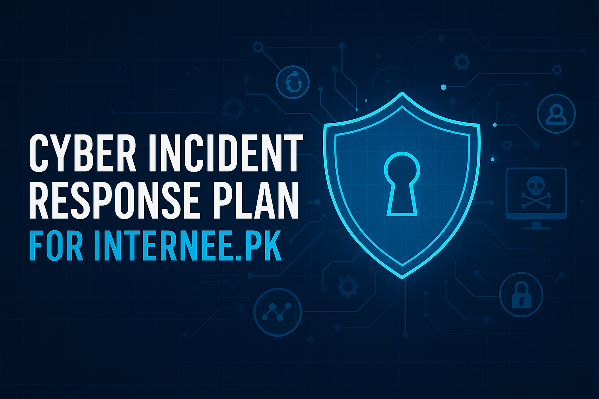

  

# 🛡️ Cyber Incident Response Plan (CIRP) – Internee.pk  

A comprehensive **Cyber Incident Response Plan (CIRP)** developed for **Internee.pk**, designed to detect, contain, and recover from cyber incidents.  
This project focuses on **ransomware response, staff training, resilience building, and regulatory compliance**.  

---

## 📘 Contents
- **Incident Response Frameworks**  
  - NIST SP 800-61r3 Lifecycle  
  - MITRE ATT&CK Mapping  
- **Incident Response Team (CIRT)** Structure & Roles  
- **Detailed IR Procedures**: Detection, Containment, Eradication, Recovery  
- **Ransomware Response Simulation & Case Studies**  
- **90-Day Staff Training Plan**  
- **Regulatory & Legal Considerations**  
- **Tools, KPIs & Continuous Improvement**  
- **Appendices**: Runbooks, Chain of Custody, Communication Templates  

---

## 🚀 Key Features
- 📊 **Ransomware Simulation Runbook (0–72 hrs)**  
- 🧩 **Case Studies** (Healthcare, Government, Tech)  
- 🎯 **KPIs & Metrics** (MTTD, MTTC, MTTR)  
- 🔐 **Compliance**: GDPR, HIPAA, PCI-DSS, SOX  
- 🛠 **Tools**: SIEM, EDR, Elastic Security Dashboard  

---

## 📂 Project Structure
Cyber-Incident-Response-Plan-For-Internee.pk/
│── docs/ # Report PDF & Supporting Material
│── runbooks/ # Incident Response Playbooks
│── training/ # Staff Training Plans & Simulations
│── templates/ # Communication & Chain-of-Custody Templates
│── README.md # Documentation

---

## 📖 How to Use
1. Review the **Incident Response Framework** and adopt policies aligned with NIST/MITRE.  
2. Train staff using the **90-Day Plan** and simulation exercises.  
3. Use the **Ransomware Runbook** during tabletop exercises.  
4. Map threats using **MITRE ATT&CK Navigator**.  

---

## 📌 Future Enhancements
- 🔄 Integration with **SOAR automation tools**  
- 📡 Expanded **threat intelligence feeds**  
- 🤖 AI/ML-based anomaly detection modules  

---

## 👨‍💻 Author
**Ahmad Sameer**  
🔗 [LinkedIn](https://www.linkedin.com/in/ahmad-sameer-17b339371/)  
📧 ahmadsameer090@gmail.com  

---

## ⭐ Contribution
Pull requests are welcome! For major changes, please open an issue first to discuss what you’d like to improve.  

---

## 📜 License
This project is released under the **License Sameer's Lab 🔬** – feel free to use and adapt it with attribution.
